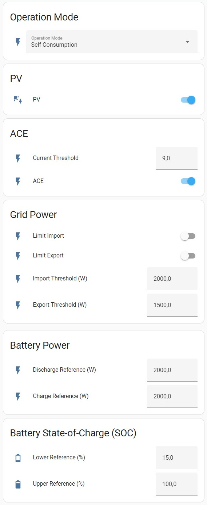

# Ferroamp Operation Settings

[![GitHub Release][releases-shield]][releases]
[![Codecov][coverage-shield]][coverage]
[![License][license-shield]][license]

[![hacs][hacsbadge]][hacs]
[![Project Maintenance][maintenance-shield]][user_profile]
[![BuyMeCoffee][buymecoffeebadge]][buymecoffee]


The Ferroamp Operation Settings integration implements the Operation Settings in the Ferroamp Portal. To control the Operation Settings from Home Assistant is an alternative to use the Scheduling function in the Ferroamp Portal.

## Requirements
- Home Assistant version 2022.7 or newer.

## Features
- Implements the Operation Settings in the Ferroamp Portal.

## Installation

### HACS

1. In Home Assistant go to HACS -> Integrations. Click on the three dots in the upper-right corner and select "Custom repositories". Paste the URL [ferroamp_operation_settings](https://github.com/jonasbkarlsson/ferroamp_operation_settings) into the Repository field. In Category select Integration. Click on ADD.
2. In Home Assistant go to HACS -> Integrations. Click on "+ Explore & Download Repositories" and search for "Ferroamp Operation Settings".
3. In Home Assistant go to Settings -> Devices & Services -> Integrations. Click on "+ Add integration" and search for "Ferroamp Operation Settings".

### Manual

1. Using the tool of choice open the folder for your Home Assistant configuration (where you find `configuration.yaml`).
2. If you do not have a `custom_components` folder there, you need to create it.
3. In the `custom_components` folder create a new folder called `ferroamp_operation_settings`.
4. Download _all_ the files from the `custom_components/ferroamp_operation_settings/` folder in this repository.
5. Place the files you downloaded in the new folder you created.
6. Restart Home Assistant.
7. In Home Assistant go to Settings -> Devices & Services -> Integrations. Click on "+ Add integration" and search for "Ferroamp Operation Settings".

## Configuration

The configuration is done in the Home Assistant user interface.

Parameter | Required | Description
-- | -- | --
Name | Yes | The device name.
System ID | Yes | The Ferroamp system ID
Login email | Yes | The email used to login to the Ferroamp Portal
Password | Yes | The password used to login to the Ferroamp Portal

With the exception of Name, the above configuration items can be changed after intial configuration in Settings -> Devices & Services -> Integrations -> Ferroamp Operation Settings -> Configure. To change Name, the native way to rename Integrations or Devices in Home Assistant can be used.

## Entities

Entities can be set using relevant service calls, `button.press`, `number.set_value`, `select.select_option` and `switch.turn_on`/`switch.turn_off`.

### Entities common for all Operation Modes

Entity | Type | Descriptions, valid value ranges.
-- | -- | --
Mode | Select |Selects one of the operation modes `Default`, `Peak Shaving` or `Self Consumption`.
PV | Switch | Enables PV strings.
ACE threshold | Number | Current threshold for the ACE function. Valid values min=0.0, step=0.1, max=100.0. Unit "A".
ACE | Switch | Enable current equalization (ACE) when current in any Mains phase exceeds the ACE threshold.
Lower Reference | Number | Battery state-of-charge (SoC), below which it is not allowed to discharge battery. Valid values min=0.0, step=0.1, max=100.0. Unit "%".
Upper Reference | Number | Battery state-of-charge (SoC), above which it is not allowed to charge battery. Valid values min=0.0, step=0.1, max=100.0. Unit "%".
Get Data | Button | Reads the current configuration from the Ferroamp system and sets the values of all the entities.
Update | Button | Writes the values of all entities to the Ferroamp system.

### Entities used by Operation Mode Default

Entity | Type | Descriptions, valid value ranges.
-- | -- | --
Limit Import | Switch | If enabled, the system is not allowed to import power from the grid, above the Import Threshold.
Limit Export | Switch | If enabled, the system is not allowed to export power to the grid, below the Export Threshold.
Import Threshold | Number | Threshold on grid power, above which the system is not allowed to import power from the grid. Unit "W".
Export Threshold | Number | Threshold on grid power, below which the system is not allowed to export power to the grid. Unit "W".
Battery Power Mode | Select | Select one the batter power modes `Off`, `Charge` or `Discharge`.
Discharge Reference | Number | Constant power reference for the battery, as long as the SoC is within the upper and lower limits. Valid values min=0.0, step=0.1, max=100000.0. Unit "W".
Charge Reference | Number | Constant power reference for the battery, as long as the SoC is within the upper and lower limits. Valid values min=0.0, step=0.1, max=100000.0. Unit "W".

### Entities used by Operation Mode Peak Shaving

Entity | Type | Descriptions, valid value ranges.
-- | -- | --
Limit Import | Switch | If enabled, the system is not allowed to import power from the grid, above the Discharge Threshold.
Limit Export | Switch | If enabled, the system is not allowed to export power to the grid, below the Charge Threshold.
Discharge Threshold | Number | Threshold on grid power, correspondning to consumption peaks, above which battery may be discharged to compensate for loads. Unit "W".
Charge Threshold | Number | Threshold on grid power, corresponding to off-peak consumption, below which battery may be charged from the grid. Unit "W".
Discharge Reference | Number | Maximum battery power, up to which battery may be discharged into grid, if grid power is above the Discharge Threshold. Valid values min=0.0, step=0.1, max=100000.0. Unit "W".
Charge Reference | Number | Maximum battery power, up to which battery may be charged from grid, if grid power is below the Charge Threshold. Valid values min=0.0, step=0.1, max=100000.0. Unit "W".

### Entities used by Operation Mode Self Consumption

Entity | Type | Descriptions, valid value ranges.
-- | -- | --
Limit Import | Switch | If enabled, the system is not allowed to import power from the grid, above the Import Threshold.
Limit Export | Switch | If enabled, the system is not allowed to export power to the grid, below the Export Threshold.
Import Threshold | Number | Threshold on grid power, above which, self-consumption of PV power is prioritized. Batteries may be discharged to compensate for loads. Unit "W".
Export Threshold | Number | Threshold on grid power, below which charging batteries from PV power is prioritized. Unit "W".
Discharge Reference | Number | Maximum battery power, up to which battery may be discharged into grid, if grid power is above the Import Threshold. Valid values min=0.0, step=0.1, max=100000.0. Unit "W".
Charge Reference | Number | Maximum battery power, up to which charging battery from PV power is prioritized, if grid power is below the Export Threshold. Valid values min=0.0, step=0.1, max=100000.0. Unit "W".


## Lovelace UI


```
type: vertical-stack
cards:
  - type: entities
    entities:
      - entity: select.ferroamp_operation_settings_mode
        name: Operation Mode
    title: Operation Mode
    show_header_toggle: false
  - type: entities
    entities:
      - entity: switch.ferroamp_operation_settings_pv
        name: PV
    title: PV
    show_header_toggle: false
  - type: entities
    entities:
      - entity: number.ferroamp_operation_settings_ace_threshold
        name: Current Threshold (A)
      - entity: switch.ferroamp_operation_settings_ace
        name: ACE
    title: ACE
    show_header_toggle: false
  - type: conditional
    conditions:
      - entity: select.ferroamp_operation_settings_mode
        state: Self Consumption
    card:
      type: entities
      entities:
        - entity: switch.ferroamp_operation_settings_limit_import
          name: Limit Import
        - entity: switch.ferroamp_operation_settings_limit_export
          name: Limit Export
        - entity: number.ferroamp_operation_settings_import_threshold
          name: Import Threshold (W)
        - entity: number.ferroamp_operation_settings_export_threshold
          name: Export Threshold (W)
      title: Grid Power
      show_header_toggle: false
  - type: conditional
    conditions:
      - entity: select.ferroamp_operation_settings_mode
        state: Default
    card:
      type: entities
      entities:
        - entity: switch.ferroamp_operation_settings_limit_import
          name: Limit Import
        - entity: switch.ferroamp_operation_settings_limit_export
          name: Limit Export
        - entity: number.ferroamp_operation_settings_import_threshold
          name: Import Threshold (W)
        - entity: number.ferroamp_operation_settings_export_threshold
          name: Export Threshold (W)
      title: Grid Power
      show_header_toggle: false
  - type: conditional
    conditions:
      - entity: select.ferroamp_operation_settings_mode
        state: Peak Shaving
    card:
      type: entities
      entities:
        - entity: switch.ferroamp_operation_settings_limit_import
          name: Limit Import
        - entity: switch.ferroamp_operation_settings_limit_export
          name: Limit Export
        - entity: number.ferroamp_operation_settings_discharge_threshold
          name: Discharge Threshold (W)
        - entity: number.ferroamp_operation_settings_charge_threshold
          name: Charge Threshold (W)
      title: Grid Power
      show_header_toggle: false
  - type: vertical-stack
    cards:
      - type: conditional
        conditions:
          - entity: select.ferroamp_operation_settings_mode
            state: Default
        card:
          type: entities
          entities:
            - entity: select.ferroamp_operation_settings_battery_power_mode
              name: Battery Power Mode
          title: Battery Power
      - type: conditional
        conditions:
          - entity: select.ferroamp_operation_settings_battery_power_mode
            state: Charge
          - entity: select.ferroamp_operation_settings_mode
            state: Default
        card:
          type: entities
          entities:
            - entity: number.ferroamp_operation_settings_charge_reference
              name: Charge Reference (W)
          show_header_toggle: false
      - type: conditional
        conditions:
          - entity: select.ferroamp_operation_settings_battery_power_mode
            state: Discharge
          - entity: select.ferroamp_operation_settings_mode
            state: Default
        card:
          type: entities
          entities:
            - entity: number.ferroamp_operation_settings_discharge_reference
              name: Discharge Reference (W)
          show_header_toggle: false
  - type: conditional
    conditions:
      - entity: select.ferroamp_operation_settings_mode
        state: Peak Shaving
    card:
      type: entities
      entities:
        - entity: number.ferroamp_operation_settings_discharge_reference
          name: Discharge Reference (W)
        - entity: number.ferroamp_operation_settings_charge_reference
          name: Charge Reference (W)
      title: Battery Power
      show_header_toggle: false
  - type: conditional
    conditions:
      - entity: select.ferroamp_operation_settings_mode
        state: Self Consumption
    card:
      type: entities
      entities:
        - entity: number.ferroamp_operation_settings_discharge_reference
          name: Discharge Reference (W)
        - entity: number.ferroamp_operation_settings_charge_reference
          name: Charge Reference (W)
      title: Battery Power
      show_header_toggle: false
  - type: entities
    entities:
      - entity: number.ferroamp_operation_settings_lower_reference
        name: Lower Reference (%)
      - entity: number.ferroamp_operation_settings_upper_reference
        name: Upper Reference (%)
    title: Battery State-of-Charge (SOC)
    show_header_toggle: false
  - type: entities
    entities:
      - entity: button.ferroamp_operation_settings_get_data
        name: Get Data
      - entity: button.ferroamp_operation_settings_update
        name: Update
    title: Control
    show_header_toggle: false
```

### Example of automation to TBD
```
```


[ferroamp_operation_settings]: https://github.com/jonasbkarlsson/ferroamp_operation_settings
[releases-shield]: https://img.shields.io/github/v/release/jonasbkarlsson/ferroamp_operation_settings?style=for-the-badge
[releases]: https://github.com/jonasbkarlsson/ferroamp_operation_settings/releases
[coverage-shield]: https://img.shields.io/codecov/c/gh/jonasbkarlsson/ferroamp_operation_settings?style=for-the-badge&logo=codecov
[coverage]: https://app.codecov.io/gh/jonasbkarlsson/ferroamp_operation_settings
[license-shield]: https://img.shields.io/github/license/jonasbkarlsson/ferroamp_operation_settings?style=for-the-badge
[license]: https://github.com/jonasbkarlsson/ferroamp_operation_settings/blob/main/LICENSE
[hacs]: https://github.com/hacs/integration
[hacsbadge]: https://img.shields.io/badge/HACS-Custom-41BDF5.svg?style=for-the-badge
[maintenance-shield]: https://img.shields.io/badge/maintainer-Jonas%20Karlsson%20@jonasbkarlsson-41BDF5.svg?style=for-the-badge
[user_profile]: https://github.com/jonasbkarlsson
[buymecoffeebadge]: https://img.shields.io/badge/buy%20me%20a%20coffee-donate-FFDD00.svg?style=for-the-badge&logo=buymeacoffee
[buymecoffee]: https://www.buymeacoffee.com/jonasbkarlsson
