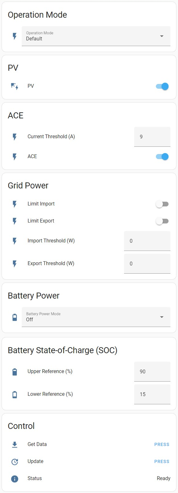

# Ferroamp Operation Settings

[![GitHub Release][releases-shield]][releases]
[![Codecov][coverage-shield]][coverage]
[![License][license-shield]][license]

[![hacs][hacsbadge]][hacs]
[![Project Maintenance][maintenance-shield]][user_profile]
[![BuyMeCoffee][buymecoffeebadge]][buymecoffee]


The Ferroamp Operation Settings integration

## Requirements
- Home Assistant version 2022.7 or newer.

## Features
- TBD

## Installation

### HACS

1. In Home Assistant go to HACS -> Integrations. Click on the three dots in the upper-right corner and select "Custom repositories". Paste the URL [ferroamp_operation_settings](https://github.com/jonasbkarlsson/ferroamp_operation_settings) into the Repository field. In Category select Integration. Click on ADD.
2. In Home Assistant go to HACS -> Integrations. Click on "+ Explore & Download Repositories" and search for "Ferroamp Operation Settings".
3. In Home Assistant go to Settings -> Devices & Services -> Integrations. Click on "+ Add integration" and search for "Ferroamp Operation Settings".

### Manual

1. Using the tool of choice open the folder for your Home Assistant configuration (where you find `configuration.yaml`).
2. If you do not have a `custom_components` folder there, you need to create it.
3. In the `custom_components` folder create a new folder called `ferroamp_operation_settings`.
4. Download _all_ the files from the `custom_components/ferroamp_operation_settings/` folder in this repository.
5. Place the files you downloaded in the new folder you created.
6. Restart Home Assistant.
7. In Home Assistant go to Settings -> Devices & Services -> Integrations. Click on "+ Add integration" and search for "Ferroamp Operation Settings".

## Configuration

The configuration is done in the Home Assistant user interface.

Parameter | Required | Description
-- | -- | --
TBD | Yes | TBD

With the exception of Name, the above configuration items can be changed after intial configuration in Settings -> Devices & Services -> Integrations -> Ferroamp Operation Settings -> 1 device -> Configure. To change Name, the native way to rename Integrations or Devices in Home Assistant can be used.

### Configuration entities

Entity | Type | Descriptions, valid value ranges and service calls
-- | -- | --
TBD | TBD | TBD

## Entities

Entity | Type | Description
-- | -- | --
TBD | TBD | TBD

## Lovelace UI


```
type: vertical-stack
cards:
  - type: entities
    entities:
      - entity: select.ferroamp_operation_settings_mode
        name: Operation Mode
    title: Operation Mode
    show_header_toggle: false
  - type: entities
    entities:
      - entity: switch.ferroamp_operation_settings_pv
        name: PV
    title: PV
    show_header_toggle: false
  - type: entities
    entities:
      - entity: number.ferroamp_operation_settings_ace_threshold
        name: Current Threshold (A)
      - entity: switch.ferroamp_operation_settings_ace
        name: ACE
    title: ACE
    show_header_toggle: false
  - type: conditional
    conditions:
      - entity: select.ferroamp_operation_settings_mode
        state: Self Consumption
    card:
      type: entities
      entities:
        - entity: switch.ferroamp_operation_settings_limit_import
          name: Limit Import
        - entity: switch.ferroamp_operation_settings_limit_export
          name: Limit Export
        - entity: number.ferroamp_operation_settings_import_threshold
          name: Import Threshold (W)
        - entity: number.ferroamp_operation_settings_export_threshold
          name: Export Threshold (W)
      title: Grid Power
      show_header_toggle: false
  - type: conditional
    conditions:
      - entity: select.ferroamp_operation_settings_mode
        state: Default
    card:
      type: entities
      entities:
        - entity: switch.ferroamp_operation_settings_limit_import
          name: Limit Import
        - entity: switch.ferroamp_operation_settings_limit_export
          name: Limit Export
        - entity: number.ferroamp_operation_settings_import_threshold
          name: Import Threshold (W)
        - entity: number.ferroamp_operation_settings_export_threshold
          name: Export Threshold (W)
      title: Grid Power
      show_header_toggle: false
  - type: conditional
    conditions:
      - entity: select.ferroamp_operation_settings_mode
        state: Peak Shaving
    card:
      type: entities
      entities:
        - entity: switch.ferroamp_operation_settings_limit_import
          name: Limit Import
        - entity: switch.ferroamp_operation_settings_limit_export
          name: Limit Export
        - entity: number.ferroamp_operation_settings_discharge_threshold
          name: Discharge Threshold (W)
        - entity: number.ferroamp_operation_settings_charge_threshold
          name: Charge Threshold (W)
      title: Grid Power
      show_header_toggle: false
  - type: vertical-stack
    cards:
      - type: conditional
        conditions:
          - entity: select.ferroamp_operation_settings_mode
            state: Default
        card:
          type: entities
          entities:
            - entity: select.ferroamp_operation_settings_battery_power_mode
              name: Battery Power Mode
          title: Battery Power
      - type: conditional
        conditions:
          - entity: select.ferroamp_operation_settings_battery_power_mode
            state: Charge
          - entity: select.ferroamp_operation_settings_mode
            state: Default
        card:
          type: entities
          entities:
            - entity: number.ferroamp_operation_settings_charge_reference
              name: Charge Reference (W)
          show_header_toggle: false
      - type: conditional
        conditions:
          - entity: select.ferroamp_operation_settings_battery_power_mode
            state: Discharge
          - entity: select.ferroamp_operation_settings_mode
            state: Default
        card:
          type: entities
          entities:
            - entity: number.ferroamp_operation_settings_discharge_reference
              name: Discharge Reference (W)
          show_header_toggle: false
  - type: conditional
    conditions:
      - entity: select.ferroamp_operation_settings_mode
        state: Peak Shaving
    card:
      type: entities
      entities:
        - entity: number.ferroamp_operation_settings_discharge_reference
          name: Discharge Reference (W)
        - entity: number.ferroamp_operation_settings_charge_reference
          name: Charge Reference (W)
      title: Battery Power
      show_header_toggle: false
  - type: conditional
    conditions:
      - entity: select.ferroamp_operation_settings_mode
        state: Self Consumption
    card:
      type: entities
      entities:
        - entity: number.ferroamp_operation_settings_discharge_reference
          name: Discharge Reference (W)
        - entity: number.ferroamp_operation_settings_charge_reference
          name: Charge Reference (W)
      title: Battery Power
      show_header_toggle: false
  - type: entities
    entities:
      - entity: number.ferroamp_operation_settings_lower_reference
        name: Lower Reference (%)
      - entity: number.ferroamp_operation_settings_upper_reference
        name: Upper Reference (%)
    title: Battery State-of-Charge (SOC)
    show_header_toggle: false
  - type: entities
    entities:
      - entity: button.ferroamp_operation_settings_get_data
        name: Get Data
      - entity: button.ferroamp_operation_settings_update
        name: Update
    title: Control
    show_header_toggle: false
```

### Example of automation to TBD
```
```


[ferroamp_operation_settings]: https://github.com/jonasbkarlsson/ferroamp_operation_settings
[releases-shield]: https://img.shields.io/github/v/release/jonasbkarlsson/ferroamp_operation_settings?style=for-the-badge
[releases]: https://github.com/jonasbkarlsson/ferroamp_operation_settings/releases
[coverage-shield]: https://img.shields.io/codecov/c/gh/jonasbkarlsson/ferroamp_operation_settings?style=for-the-badge&logo=codecov
[coverage]: https://app.codecov.io/gh/jonasbkarlsson/ferroamp_operation_settings
[license-shield]: https://img.shields.io/github/license/jonasbkarlsson/ferroamp_operation_settings?style=for-the-badge
[license]: https://github.com/jonasbkarlsson/ferroamp_operation_settings/blob/main/LICENSE
[hacs]: https://github.com/hacs/integration
[hacsbadge]: https://img.shields.io/badge/HACS-Custom-41BDF5.svg?style=for-the-badge
[maintenance-shield]: https://img.shields.io/badge/maintainer-Jonas%20Karlsson%20@jonasbkarlsson-41BDF5.svg?style=for-the-badge
[user_profile]: https://github.com/jonasbkarlsson
[buymecoffeebadge]: https://img.shields.io/badge/buy%20me%20a%20coffee-donate-FFDD00.svg?style=for-the-badge&logo=buymeacoffee
[buymecoffee]: https://www.buymeacoffee.com/jonasbkarlsson
